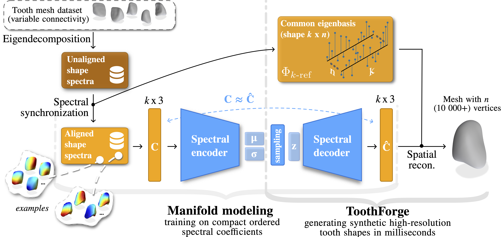
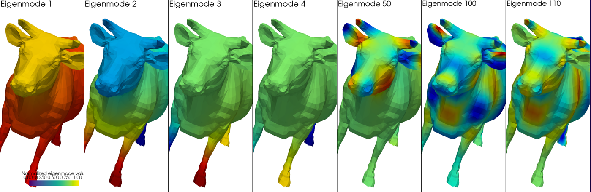

# 🦷 ToothForge: Automatic Dental Shape Generation using Synchronized Spectral Embeddings

<div align="center">
  <a href="https://arxiv.org/abs/2506.02702"></a> &ensp;
</div>

<div align="center">
  
[Tibor Kubik](https://scholar.google.com/citations?user=Zb6MSKcAAAAJ), [Francois Guibault](https://scholar.google.com/citations?user=KF8zbPUAAAAJ&hl=sk&oi=ao), [Michal Spanel](https://scholar.google.com/citations?hl=sk&user=75XIbgQAAAAJ) and [Herve Lombaert](https://scholar.google.com/citations?hl=sk&user=KQbyRzIAAAAJ)



</div>


## 🔥 News and Todo
* 💻 June 2025: Preparation of this GitHub repository.
* 🗣️ May 2025: ToothForge hits the spotlight! Presented as an oral talk at [IPMI 2025](https://ipmi2025.org/), one of the leading venues for medical imaging research.
* 🎉 February 2025: ToothForge is officially accepted to [IPMI 2025](https://ipmi2025.org/) with a competitive 26% acceptance rate.

## Abstract
We introduce ToothForge, a spectral approach for automatically generating novel 3D teeth, effectively addressing the sparsity of dental shape datasets. By operating in the spectral domain, our method enables compact machine learning modeling, allowing the generation of high-resolution tooth meshes in milliseconds. However, generating shape spectra comes with the instability of the decomposed harmonics. To address this, we propose modeling the latent manifold on synchronized frequential embeddings. Spectra of all data samples are aligned to a common basis prior to the training procedure, effectively eliminating biases introduced by the decomposition instability. Furthermore, synchronized modeling removes the limiting factor imposed by previous methods, which require all shapes to share a common fixed connectivity. Using a private dataset of real dental crowns, we observe a greater reconstruction quality of the synthetized shapes, exceeding those of models trained on unaligned embeddings. We also explore additional applications of spectral analysis in digital dentistry, such as shape compression and interpolation. ToothForge facilitates a range of approaches at the intersection of spectral analysis and machine learning, with fewer restrictions on mesh structure. This makes it applicable for shape analysis not only in dentistry, but also in broader medical applications, where guaranteeing consistent connectivity across shapes from various clinics is unrealistic.

## Requirements
The code was tested on

* Ubuntu 24.04
* Python 3.12
* PyTorch 2.7.0
* 1 NVIDIA GPU with CUDA version 11.8 (the method is not memory heavy, at least when using 256 embeddings, so any gpu with at least 8GB will work).

### Setup an environment
```shell
conda create -n toothForge python==3.12
conda activate toothForge
```
### Install PyTorch (optional: if you plan to train a model, not just apply decomposition/alignment)
```shell
pip install torch torchvision torchaudio --index-url https://download.pytorch.org/whl/cu118
```

### Other Dependencies
```shell
pip install -r requirements.txt
```
Note: to avoid dependency conflicts, please make sure to use the exact package versions specified in `requirements.txt`. 

## Applying Spectral Decomposition
To apply spectral decomposition, create an instance of `SpectralMesh`. This requires
either path to the shape file or a `trimesh` object. The shape can be in any format supported by `trimesh`, such as `.obj`, `.stl`, or `.ply`. 
The `k` parameter specifies the number of shape-specific spectral embeddings to generate, which can be adjusted based on the desired resolution and detail of the shape.
Note that the number of embeddings must be less than the number of vertices in the mesh and that bigger the number, the slower the decomposition will be.

```python
mesh = SpectralMesh('data/cow.obj', k=256)
```
Once the instance is created, you can access the mesh geometry, encapsulated trimesh instance, and the
eigen values and eigen modes (`mesh.graph.eig_vals` and `mesh.graph.eig_vecs`).

You can use various member methods, for example to visualize the spectral embeddings:

```python
   mesh.visualize_shape_eigenmodes([1, 2, 3, 4, 50, 100, 110])
```

This will plot a window using `pyvista` with 7 sub-windows, each showing the shape colored by the specified eigenmode.
Note that any list of integers can be passed, if the values are valid.



There is also a method for mesh compression. Simply call `mesh.low_pass_filter(k=40)` to compress
the mesh using leading 40 eigenmodes (change the number to adjust the compression level: the lower, the less high-frequency details).


## Data Preparation for Training (with Embedding Synchronization)
There is a dedicated script for generating synchronized embeddings from a set of meshes: `python generate_train_data.py --folder-path-in --folder-path-out`.
It requires a path to input folder with meshes and a path to output folder where the data for training will be saved.
The script will read all meshes from the input folder, perform spectral decomposition, and save the synchronized embeddings in the output folder.
The synchronization is done towards the first mesh in the input folder, referred to as template.
Once finished, each shape is now represented with its folder in the output folder, containing the following files:
* `spatial.h5`: information about vertices and edges
* `spec_coeff.h5`: original spectral coefficients (vertices projected through non-synchronized basis)
* `spec_rotation.h5`: rotation matrix used for synchronization
* `spectrum.h5`: original eigenvalues and eigenvectors

These files are necessary for training the model.
For convenience and double-check that the process is correct, the script also saves several `stl` files, of original mesh, spectral reconstructions applied through
template basis with and without synchronization, etc.
Note that for training, additional `split.txt` file should be created, compatible with the training pipeline.

## Running Training
To train an autoencoder, use the script `train.py`. Internally, the script uses `hydra` and `omegaconf` packages
to manage the configuration. Configuration files are located in `configuration/`, 
and it can be modified to adjust the training parameters and specify paths to data.

## 🔗 BibTeX
If you find this work useful for your research and applications, please cite using this BibTeX:

```bibtex
@misc{kubik25toothforge,
      title={ToothForge: Automatic Dental Shape Generation using Synchronized Spectral Embeddings}, 
      author={Tibor Kubik and Francois Guibault and Michal Spanel and Herve Lombaert},
      year={2025},
      eprint={2506.02702},
      archivePrefix={arXiv},
      primaryClass={cs.CV},
      url={https://arxiv.org/abs/2506.02702}, 
}
```
